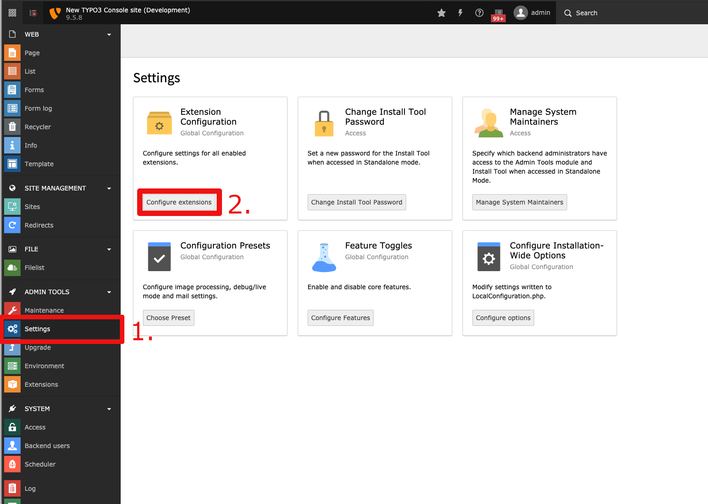
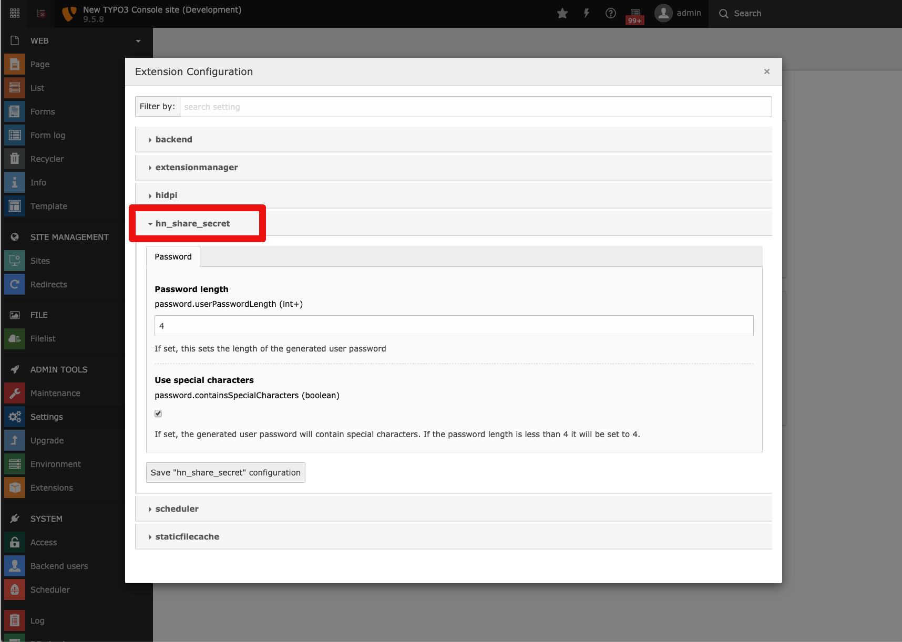
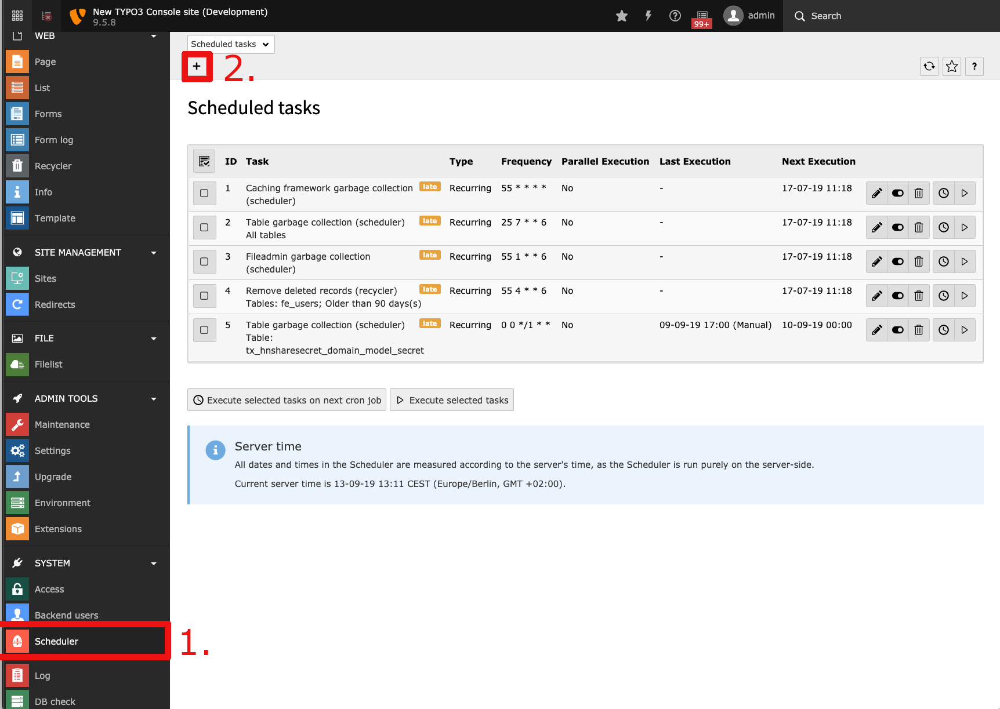
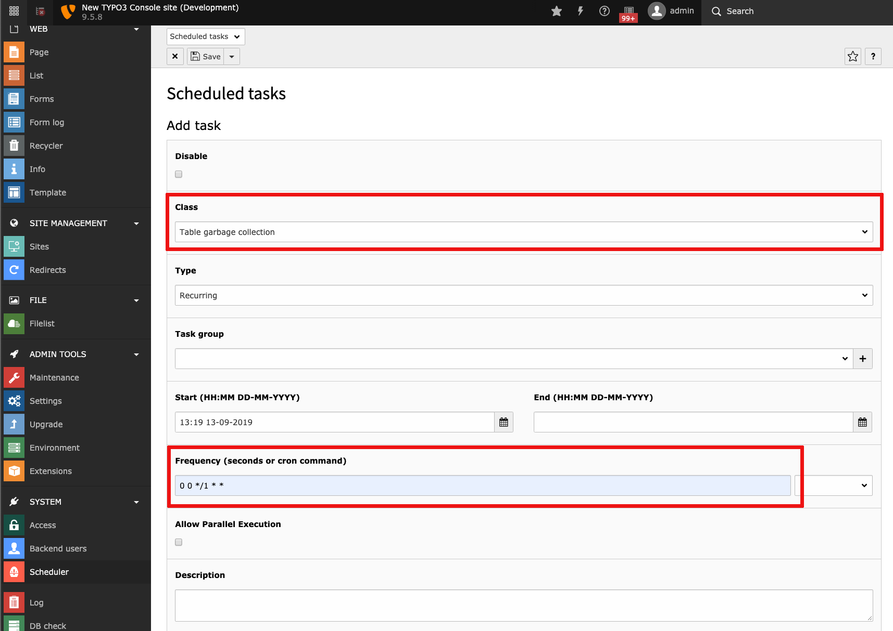
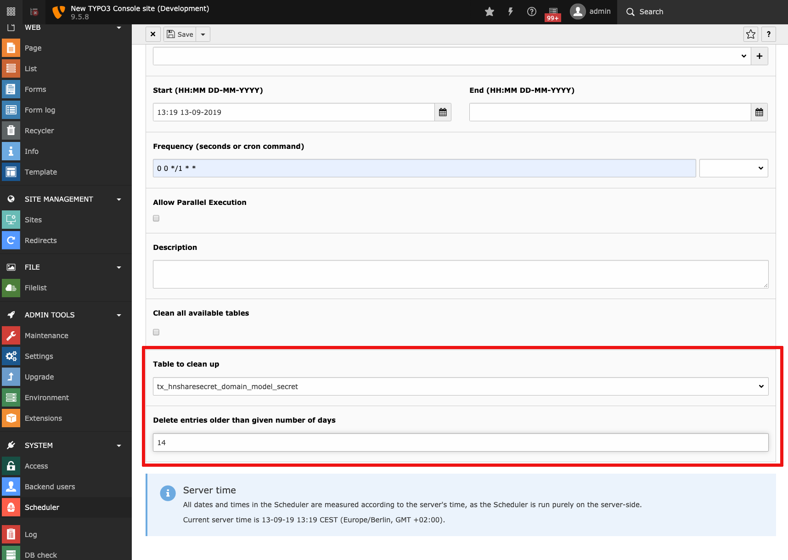

.. include:: ../Includes.txt

.. _configuration:

=============
Configuration
=============

.. _password-configuration:

Password
--------

You can configure the length of the generated password an whether it should
contain special characters or not.

Access the backend of Typo3 and click on 
:guilabel:`ADMIN TOOLS > Settings > Configure extensions > share_a_secret`:

.. note::
   A valid pregenerated password contains at least three or four characters.
   If it contains special characters it will be at least four characters long,
   three otherwise. Setting an invalid value will make the password have
   the minimum valid length.

.. _auto-delete-messages:

Automatically delete messages
-----------------------------

Messages which are older than a given number of days can be 
automatically deleted from the database. 
All you need to do is set up a Cronjob with the scheduler-extension,
which was installed as a dependency for this extension.
Inside the Typo3 backend, click on :guilabel:`SYSTEM > Scheduler` and click
on the plus-button:

In the section **Class** select **Table garbage collection**.
In the section **Frequency** you can specify the frequency 
(using cronjob syntax) with which
the scheduler searches for expired messages. In the following example the 
scheduler will search for expired messages every day at 0:00am: 

In the section **Table to clean up** you choose 
**tx_shareasecret_domain_model_secret**

Last thing to do is to specify after how many days a message 
should get deleted. Set this according to your needs.

