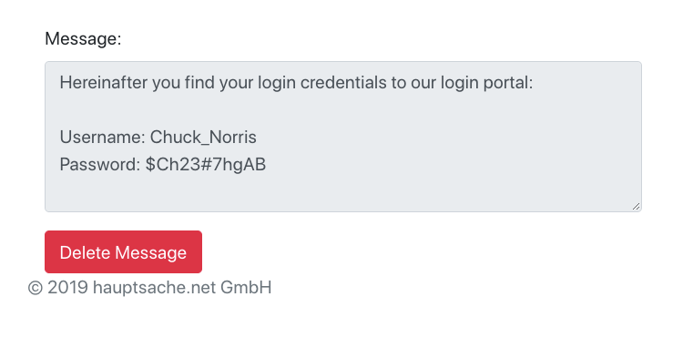

.. include:: ../Includes.txt

.. _for-editors:

===========
For Editors
===========

Target group: **Editors**

At the time of writing the extension can only be used after you accessed the Typo3 backend.
After inserting the plugin on a page and viewing the page, you see the following input form:

.. figure:: ../Images/UserManual/new-message.png
   :class: with-shadow
   :width: 500px

In the message textarea you write the text you want to encrypt. Below the textarea you see
a prefilled password field. This password is needed to view the message.

After clicking on "Generate Link" you see the following:

.. figure:: ../Images/UserManual/generated-link.png
   :class: with-shadow
   :width: 500px

In the upper textarea you see a generated link. This is the link you send to your recipient.
Below that textarea you see a pregenerated password. This password is needed by the recipient
to view the message. Notice:

.. important::
   Do not share the password together with your link. Send your password over another media
   like telephone or SMS. See :ref:`editor-faq`.

A click on the link brings your recipient to a password input form:

After entering the correct password, the message will show up:

After viewing the message, the recipient can decide to delete it.
This will delete the encrypted message in your database, never to be seen again.

You can also configure the extension to delete every message automatically if it 
is older than a given number of days, see :ref:`configuration`

.. _editor-faq:

FAQ
===
Why can't I send the password and link altogether?
--------------------------------------------------

If you send the link and the password altogether in an email and an attacker
managed to get hold of that email, then the attacker has all the information
that is needed to view the message.

Sending the password over another media like a phone makes it harder for an
attacker to view the message. The attacker would have to get hold of that email
AND tap your phone.
