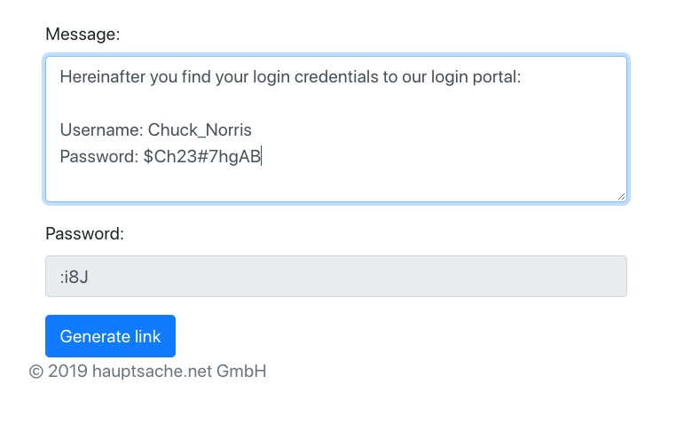
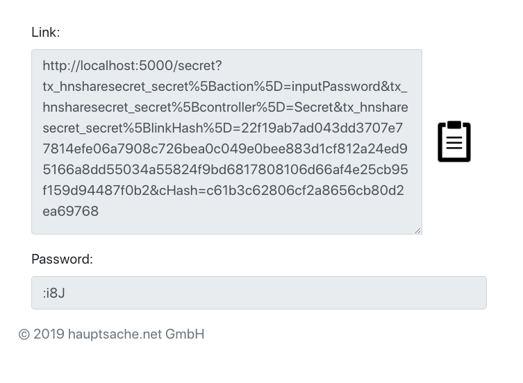

.. include:: ../Includes.txt

.. _introduction:

============
Introduction
============

.. _what-it-does:

What does it do?
================

This extension allows you to easily share an encrypted message containing sensitive information like
usernames and passwords. It generates a link and a password for your message. Anyone who
knows the link and the password can view the message. 

.. important::
   Do not share the password together with your link. Send your password over another media
   like telephone or SMS. See :ref:`editor-faq`.

.. _screenshots:

Screenshots
===========

Create a message with a pregenerated password: 

   
   Create a message

A click on "Generate link" will show you a link and the password needed to view the message:

   The generated link and password to the secret

The generated link leads to a password input form:

.. figure:: ../Images/UserManual/input-password.png
   :class: with-shadow
   :alt: Introduction Package
   :width: 500px

   Input password form

After entering the password the message will show up:

.. figure:: ../Images/UserManual/show-message.png
   :class: with-shadow
   :alt: Introduction Package
   :width: 500px

   The secret message
